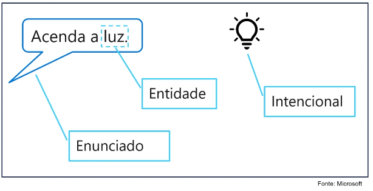

# Capacidades de processamento de linguagem natural da azure

## Analisador de texto

Aqui onde eu coloco uma frase e consigo extrair alguma características como:

idioma predominante, sentimento, frase-chave, entidades...

## Serviço de bot do azure

Nosso serviço de bot se torna eficiente pela quantidade de dados que alimentamos
o nosso banco de informações no serviço de bot da azure.

alguns usos são: mandar email, dar suporte em um site, usar como bot no whats app,
essas respostas serão dadas a partir de palavras chaves.

## Compreensão da linguagem coloquial

Exemplo de mensagem coloquial: você chega em casa e pede para alexa "Acenda
a Luz".

podemos também usar reconhecimento de síntese de fala que ira ajudar por exemplo
a dar acessibilidade na nossa aplicação.

## documentação

1. https://aka.ms/ai900-speech

2. https://aka.ms/ai900-text-analysis

## exemplo de sentença:

Tired hotel with poor service
The Royal Hotel, London, United Kingdom
5/6/2018
This is an old hotel (has been around since 1950's) and the room furnishings are
average - becoming a bit old now and require changing. The internet didn't work
and had to come to one of their office rooms to check in for my flight home.
The website says it's close to the British Museum, but it's too far to walk.

